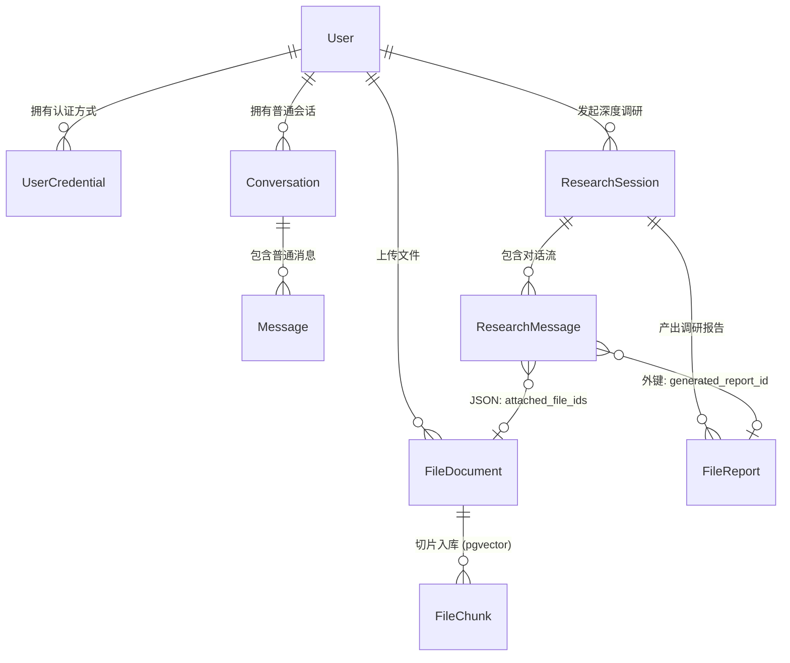
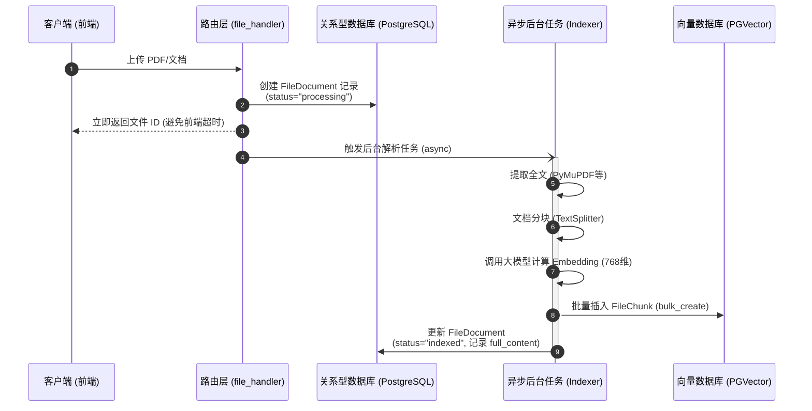
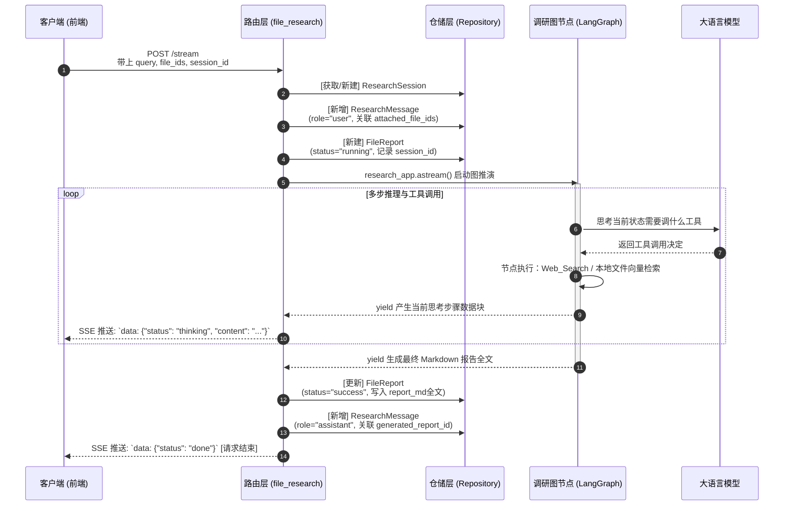

# LangChain 项目核心架构图志 (Architecture)

本文档采用 **Docs-as-Code** 的方式管理项目架构。
请通过能渲染 Mermaid 语法的工具（如 GitHub、VSCode 预览插件、Neovim 的 `markdown-preview.nvim`）来阅读本文档。

## 1. 核心实体关系图 (ER Diagram)

数据库层面，我们将业务划分为三个核心域：**认证与基础域**、**知识库域**、**研究与聊天域**。

---

## 2. 核心业务时序图 (Sequence Diagrams)

### 2.1 文档入库与切片处理流程
当用户上传文档时，系统如何将文档转化为支持向量检索的知识库资产。

### 2.2 深度调研流式图工作流 (LangGraph + SSE)
这也是即将实施的 Task 7 的完整业务闭环逻辑。

---

## 3. 三层架构约束说明

本项目严格遵循后端分层架构，避免“意大利面条式”代码：

1. **Router 层 (路由接入)**：仅负责 HTTP 请求验证、获取用户身份 (User ID)、解析 JSON 体，以及进行 SSE 流式包装。禁止在此层写 SQL 或复杂的业务条件。
2. **Service / Graph 层 (业务逻辑与编排)**：核心心脏。负责拼装 Prompt、调用 LLM、管理状态机 (StateGraph) 以及数据校验。
3. **Repository 层 (数据仓储)**：无感情的数据库工人。只暴露针对实体 (Session, Message, Report, Document) 的 `create`, `get`, `update` 异步方法。所有 SQLAlchemy 语法（如 `select`, `commit`, `refresh`）严格限制在此层内。
